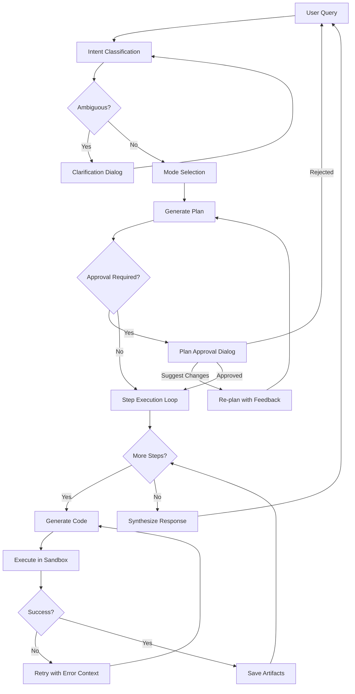

# Constat Architecture

Constat is a multi-step AI reasoning engine for data analysis with verifiable, auditable logic. It enables natural language querying across multiple data sources (SQL, NoSQL, files, APIs) with full provenance tracing.

## Core Concepts

### Sessions

A **Session** is a stateful conversation that maintains context across queries. Each session has:

- **Scratchpad**: Running summary of what's been computed
- **DataStore**: Persisted DataFrames and artifacts from previous steps
- **History**: Full execution trace for resumption

Sessions allow follow-up questions like "now filter to Q4" without re-explaining context.

### Plans & Steps

Every query is decomposed into a **Plan** with one or more **Steps**:

```
"Top 5 customers by revenue with their recent orders"
  → Step 1: Query customer revenue totals
  → Step 2: Sort and take top 5
  → Step 3: Join with recent orders
  → Step 4: Format result
```

Each step generates Python code, executes it in a sandbox, and saves results to the DataStore for subsequent steps.

### Execution Modes

| Mode | Purpose | Trigger |
|------|---------|---------|
| **Exploratory** | Multi-step data analysis, visualization | Default for data questions |
| **Auditable** | Fact resolution with derivation traces | `/prove` command or compliance context |
| **Knowledge** | Document lookup + LLM synthesis | Questions about concepts, not data |

### Artifacts

Steps produce **artifacts** that persist across the session:

- **Tables**: DataFrames saved to DataStore
- **Code**: Generated Python for each step
- **Charts**: Plotly/Folium visualizations
- **Traces**: Derivation proofs (auditable mode)

## Module Map

```
constat/
├── core/           # Config, models, roles
├── execution/      # Planning and code execution
├── catalog/        # Schema introspection
├── discovery/      # On-demand tools for LLM
├── providers/      # LLM integrations
├── storage/        # Persistence layer
├── server/         # FastAPI backend
├── repl/           # Terminal interface
└── session.py      # Central orchestrator
```

### discovery/

The intelligence layer that enables the LLM to find relevant data sources.

**The most important tool is `search_all(query)`** - a unified vector search across all source types:

```
User asks: "employee compensation trends"
    ↓
search_all("employee compensation trends")
    ↓
Vector embeddings queried via DuckDB array_cosine_similarity()
    ↓
Returns ranked results from:
  - Tables: employees, salaries, compensation_history
  - APIs: GET /payroll/reports, GET /hr/compensation
  - Documents: "Compensation Policy.md", "Salary Bands.pdf"
```

This is the **primary discovery mechanism**. The LLM calls `search_all` first, then drills down with specific tools (`get_table_schema`, `get_document`, etc.).

| File | Responsibility |
|------|----------------|
| `tools.py` | Unified tool registry, routes LLM tool calls |
| `schema_tools.py` | `search_all`, `search_tables`, `find_entity` |
| `doc_tools.py` | `search_documents` with vector embeddings |
| `api_tools.py` | `search_operations` for API discovery |
| `vector_store.py` | DuckDB VSS backend for embedding storage/search |

**Vector Store Architecture:**
- Backend: DuckDB with VSS extension
- Embeddings: BAAI/bge-large-en-v1.5 (1024 dimensions)
- Unified `entities` table stores all source types (schema, api, document)
- `array_cosine_similarity()` for fast similarity ranking

### execution/

The brain of the system.

| File | Responsibility |
|------|----------------|
| `planner.py` | Converts natural language → multi-step Plan |
| `executor.py` | Runs generated code in sandboxed subprocess |
| `fact_resolver.py` | Auditable fact derivation with provenance |
| `intent_classifier.py` | Determines user intent and detects ambiguity |
| `mode.py` | Selects Exploratory vs Auditable vs Knowledge |
| `scratchpad.py` | Maintains execution context across steps |

### catalog/

Unified schema layer across heterogeneous data sources.

| File | Responsibility |
|------|----------------|
| `schema_manager.py` | Introspects SQL, NoSQL, files into unified schema |
| `api_catalog.py` | GraphQL/OpenAPI discovery |
| `file/connector.py` | CSV, JSON, Parquet handling |

All sources appear uniformly to the LLM: tables with columns, regardless of underlying technology.

### providers/

LLM abstraction with automatic task routing.

| File | Responsibility |
|------|----------------|
| `base.py` | `BaseLLMProvider` interface |
| `anthropic.py`, `openai.py`, etc. | Provider implementations |
| `router.py` | Routes tasks to models, escalates on failure |

The router enables cost optimization (local models first) and graceful degradation.

### storage/

Persistence across steps and sessions.

| File | Responsibility |
|------|----------------|
| `datastore.py` | DataFrame storage (SQLite/DuckDB/PostgreSQL) |
| `history.py` | Session history for `/resume` |
| `learnings.py` | Error-to-fix patterns for improvement |

### server/

FastAPI backend for the web UI.

| File | Responsibility |
|------|----------------|
| `app.py` | FastAPI application factory |
| `session_manager.py` | Session lifecycle, cleanup, user isolation |
| `routes/queries.py` | Query execution (REST + WebSocket) |
| `routes/sessions.py` | Session CRUD |
| `auth.py` | Firebase authentication (optional) |

## Session Flow



### Plan Modification Loop

A key architectural feature is **iterative plan refinement**. Users don't just approve or reject - they can suggest changes and the system re-plans:

```
User: "Show me Q4 revenue by region"
    ↓
System generates plan:
  Step 1: Query revenue data
  Step 2: Filter to Q4
  Step 3: Group by region
    ↓
User: "Also break it down by product category"
    ↓
System re-plans with feedback:
  Step 1: Query revenue data
  Step 2: Filter to Q4
  Step 3: Group by region AND product_category  ← modified
  Step 4: Create pivot table                     ← added
```

**Approval responses:**
- `APPROVE` → proceed to execution
- `REJECT` → cancel entirely
- `SUGGEST` → provide feedback, trigger re-planning (up to 3 attempts)
- `COMMAND` → run a meta command (e.g., `/help`)

**Mid-execution re-planning:** Users can also modify plans during execution. The system cancels the current execution (preserving completed work) and returns to planning with the user's modifications as context.

### Step Execution Detail

Each step follows this cycle:

1. **Code Generation**: LLM sees step goal + schema + previous outputs
2. **Sandbox Execution**: Subprocess with timeout, import whitelist
3. **Error Handling**: On failure, LLM sees error and retries (up to 10 attempts)
4. **Artifact Persistence**: DataFrames saved to DataStore, events emitted

Code has access to:
- `db_<name>`: Database connections
- `file_<name>`: File paths
- `store`: DataStore for saving/loading DataFrames
- Standard libraries: `pandas`, `numpy`, `plotly`

## Prompt Construction

The system makes several types of LLM calls, each with a different prompt structure and expected response format.

### Prompt Layering

Every LLM request builds a system prompt from these components:

```
┌─────────────────────────────────────────────────────┐
│  Base System Prompt                                 │
│  "You are a data analysis assistant..."             │
├─────────────────────────────────────────────────────┤
│  Role (optional)                                    │
│  User-selected persona: "financial analyst",        │
│  "compliance officer", etc. Shapes tone & focus.   │
├─────────────────────────────────────────────────────┤
│  Skills (loaded on-demand)                          │
│  Domain knowledge from SKILL.md files.              │
│  Loaded when query matches skill's domain.          │
├─────────────────────────────────────────────────────┤
│  Learnings                                          │
│  Error-to-fix patterns from previous sessions.      │
│  "When querying dates, use DATE() not DATETIME()"   │
├─────────────────────────────────────────────────────┤
│  Schema Context                                     │
│  Brief database summary OR discovery tools.         │
│  "Available: sales (5 tables), inventory (3 tables)"│
├─────────────────────────────────────────────────────┤
│  Scratchpad (for follow-ups)                        │
│  Summary of previous steps and artifacts.           │
│  "Previous: loaded Q4 data into 'revenue_df'"       │
└─────────────────────────────────────────────────────┘
                         +
┌─────────────────────────────────────────────────────┐
│  User Query                                         │
│  "Show me revenue by region for Q4"                 │
└─────────────────────────────────────────────────────┘
```

### LLM Call Types

| Call Type | Purpose | Key Inputs | Response Format |
|-----------|---------|------------|-----------------|
| **Intent Classification** | Determine what user wants | Query, conversation history | `{primary: "data_analysis", ambiguities: [...]}` |
| **Planning** | Generate multi-step plan | Query, schema context, skills | `Plan` object with ordered steps |
| **Code Generation** | Write Python for one step | Step goal, schema, previous outputs | Python code string |
| **Error Recovery** | Fix failed code | Previous code, error traceback | Corrected Python code |
| **Synthesis** | Generate final answer | All step outputs, original query | Natural language response |
| **Fact Resolution** | Derive auditable facts | Fact query, available sources | Derivation with provenance |

### Response Structures

**Plan** (from planning call):
```
Plan:
  steps:
    - goal: "Load Q4 revenue data"
      expected_inputs: []
      expected_outputs: ["revenue_df"]
    - goal: "Group by region"
      expected_inputs: ["revenue_df"]
      expected_outputs: ["regional_summary"]
  reasoning: "Need to filter by date, then aggregate..."
```

**Code** (from code generation):
```python
# Step 1: Load Q4 revenue data
df = pd.read_sql("""
    SELECT * FROM sales.transactions
    WHERE quarter = 'Q4'
""", db_sales)
store.save("revenue_df", df)
```

**Synthesis** (from synthesis call):
```
Based on the analysis, Q4 revenue by region:
- North America: $2.4M (+12% YoY)
- Europe: $1.8M (+8% YoY)
- APAC: $1.2M (+15% YoY)

The North America region showed the strongest absolute growth...
```

### Skills

Skills are domain-specific knowledge packages (SKILL.md files) that get loaded into the prompt when relevant:

```
.constat/skills/
├── financial-analysis/
│   └── SKILL.md        # Defines metrics, terminology, best practices
└── healthcare-compliance/
    └── SKILL.md        # HIPAA rules, audit requirements
```

Skills are discovered via `list_skills()` and loaded via `load_skill(name)`. The LLM can request skills during planning if it detects domain-specific terminology.

### Learnings

The system automatically learns from errors and user corrections:

**Automatic learning:** When code fails and the LLM successfully fixes it, the error→fix pattern is captured:
```
Error: "column 'date' is ambiguous"
Fix: "Use fully qualified name: orders.date"
→ Learning: "Always qualify column names in JOINs"
```

**User corrections:** Users can explicitly teach the system via `/correct`:
```
/correct "revenue" means gross_revenue, not net_revenue
```

Learnings are stored per-user and loaded into the prompt for future queries. Over time, similar learnings are compacted into general rules.

## UX Architecture

### Web UI (Vera)

```
constat-ui/
├── src/
│   ├── components/
│   │   ├── conversation/    # Message display, input
│   │   ├── artifacts/       # Tables, code, charts
│   │   └── layout/          # Main layout, toolbar
│   ├── store/
│   │   ├── sessionStore.ts  # Session state (Zustand)
│   │   └── artifactStore.ts # Artifact state
│   └── App.tsx              # Root component
```

**Tech Stack**: React 18, TypeScript, Zustand, Tailwind CSS, Plotly.js

### Layout

```
┌─────────────────────────────────────────────────────────┐
│  Toolbar: Logo | Session Info | User Menu              │
├───────────────────────────┬─────────────────────────────┤
│                           │                             │
│   Conversation Panel      │     Artifact Panel          │
│                           │                             │
│   - Message history       │     - Tables (sortable)     │
│   - Step progress         │     - Code (syntax hl)      │
│   - Input box             │     - Charts (interactive)  │
│                           │                             │
├───────────────────────────┴─────────────────────────────┤
│  Status Bar: Connection | Tokens | Model               │
└─────────────────────────────────────────────────────────┘
```

### Real-Time Feedback

WebSocket connection delivers live events:

| Event | UI Update |
|-------|-----------|
| `step_start` | Show "Step N: [goal]" with spinner |
| `generating` | Show thinking indicator |
| `executing` | Show execution indicator |
| `step_complete` | Checkmark, add artifacts |
| `clarification` | Open clarification dialog |
| `plan_approval` | Open plan review dialog |
| `error` | Show error with recovery options |

### State Management

**sessionStore** (Zustand):
- `messages`: Conversation history
- `plan`: Current execution plan
- `phase`: `idle` → `planning` → `executing` → `summarizing`
- `clarificationDialog`: Open/closed state + options
- `planApprovalDialog`: Open/closed state + plan details

**artifactStore** (Zustand):
- `tables`: Map of table name → data
- `code`: Map of step → generated code
- `charts`: Map of chart id → Plotly spec

## Data Source Integration

All data sources present a unified interface to the LLM:

```yaml
# config.yaml
databases:
  sales:
    type: postgresql
    connection_string: ${SALES_DB_URL}

  metrics:
    type: csv
    path: data/metrics.csv

  events:
    type: mongodb
    uri: ${MONGO_URI}
    database: analytics
```

SchemaManager introspects each source and produces:

```
Table: sales.customers
  - id: integer (PK)
  - name: string
  - revenue: decimal
  - created_at: timestamp
```

The LLM sees tables uniformly regardless of whether they're PostgreSQL, CSV, or MongoDB.

## Configuration

**Hierarchy** (later overrides earlier):

1. Engine defaults
2. `config.yaml` (project config)
3. Environment variables (`${VAR}`)
4. Runtime overrides

**Key Sections**:

```yaml
llm:
  provider: anthropic
  model: claude-sonnet-4
  task_routing:
    sql_generation:
      models: [sqlcoder:7b, claude-sonnet-4]  # Try local first

databases:
  # ... data source definitions

documents:
  # ... reference docs for semantic search

execution:
  timeout: 60
  max_retries: 10
  import_whitelist: [pandas, numpy, plotly]

server:
  auth_enabled: true
  session_timeout: 86400
```

## Key Design Decisions

### Step Isolation

Each step runs in a fresh subprocess. No shared Python state between steps. Data passes through the DataStore explicitly. This prevents accumulating bugs and memory leaks.

### Event-Driven UI

Backend emits events; UI subscribes via WebSocket. This decouples execution from display and enables real-time feedback without polling.

### Retry with LLM Feedback

When code fails, the LLM sees the error and previous code, then generates a corrected version. Most errors self-heal without user intervention.

### Provider Abstraction

All LLMs implement `BaseLLMProvider`. The TaskRouter can try local models first and escalate to cloud on failure. Easy to add new providers.

### Lazy Loading

Schema discovered on-demand, documents fetched only when searched, skills loaded only when accessed. Minimizes startup time and memory.

### Continuous Learning

The system improves over time through two mechanisms:

1. **Automatic:** Failed code that gets fixed → pattern captured as a learning
2. **Explicit:** User corrections via `/correct` → stored as rules

Learnings are per-user, loaded into prompts, and compacted over time. This means the system gets better at handling your specific data and terminology the more you use it.
