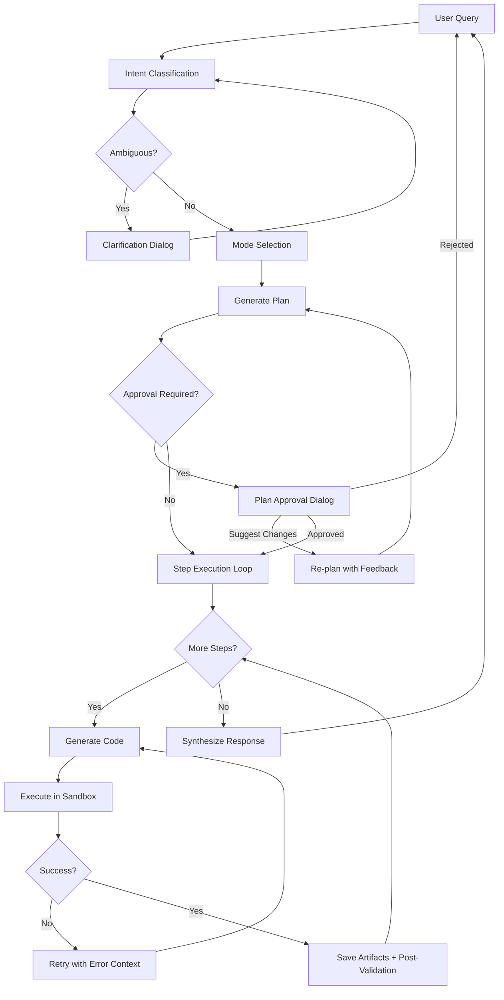

# Constat Architecture

Constat is a multi-step AI reasoning engine for data analysis with verifiable, auditable logic. It enables natural language querying across multiple data sources (SQL, NoSQL, files, APIs) with full provenance tracing.

## Core Concepts

**Mental model:**
- **Planner** = Executive (breaks down tasks, optionally delegates)
- **Skill** = Process (defines how to accomplish a class of tasks)
- **Agent** = Specialist persona (shapes how steps are executed)

Agents are optional. If the user is already a specialist, the planner simply breaks down the task into clear steps without delegation - all steps run in the user's own context.

### Sessions

A **Session** is a stateful conversation that maintains context across queries. Each session has:

- **Scratchpad**: Running narrative of what's been computed (goal + narrative + tables_created per step)
- **DuckDBSessionStore**: Single persistent DuckDB file for tables, views, metadata, and artifacts
- **History**: Full execution trace for resumption

Sessions allow follow-up questions like "now filter to Q4" without re-explaining context.

### Plans & Steps

Every query is decomposed into a **Plan** with one or more **Steps**:

```
"Top 5 customers by revenue with their recent orders"
  → Step 1: Query customer revenue totals
  → Step 2: Sort and take top 5
  → Step 3: Join with recent orders
  → Step 4: Format result
```

Each step generates Python code, executes it in a sandbox, and saves results to the DataStore for subsequent steps.

The **planner acts like an executive** - it understands the goal, breaks it into steps, and delegates each step to the best-suited agent.

### Agents (Step-Level)

Each step can optionally be assigned to an **agent**. Agents are specialist personas the planner can delegate to:

1. **Maintain isolated context** - The agent sees only what it needs, not the full session state
2. **Execute with agent-specific prompting** - Different expertise, tone, and focus
3. **Publish results back** - Output is merged into the shared session results

```
Plan:
  Step 1: [data-engineer] Extract and clean revenue data
  Step 2: [data-engineer] Join with customer demographics
  Step 3: [analyst] Identify trends and anomalies
  Step 4: [compliance] Flag potential audit concerns
```

### Execution Modes

| Mode | Purpose | Trigger |
|------|---------|---------|
| **Exploratory** | Multi-step data analysis, visualization | Default for data questions |
| **Auditable** | Fact resolution with derivation traces | `/reason` command or compliance context |
| **Knowledge** | Document lookup + LLM synthesis | Questions about concepts, not data |

### Artifacts

Steps produce **artifacts** that persist across the session:

- **Tables**: DataFrames saved to DuckDBSessionStore
- **Code**: Generated Python for each step
- **Charts**: Plotly/Folium visualizations
- **Traces**: Derivation reason-chains (auditable mode)

## System Overview

```
┌─────────────────────────────────────────────────────────────────────────────┐
│                          Client Access Layer                                 │
│  ┌──────────────┐ ┌──────────────┐ ┌──────────────┐ ┌───────────────────┐  │
│  │   Web UI     │ │     CLI      │ │  Textual     │ │    Python SDK     │  │
│  │ (constat-ui/)│ │   (cli.py)   │ │    REPL      │ │   (session.py)    │  │
│  │  React/TS    │ │              │ │(textual_     │ │                   │  │
│  │              │ │              │ │  repl.py)    │ │                   │  │
│  └──────┬───────┘ └──────┬───────┘ └──────┬───────┘ └─────────┬─────────┘  │
└─────────┼────────────────┼────────────────┼───────────────────┼────────────┘
          │                └────────────────┼───────────────────┘
          │   REST + WebSocket              │
          └──────────┐                      │
                     ▼                      │
┌─────────────────────────────────────┐     │
│  Server Layer (constat/server/)     │     │
│  ┌──────────────────────────────┐   │     │
│  │  FastAPI (app.py)            │   │     │
│  │  REST routes + WebSocket     │   │     │
│  │  SessionManager              │   │     │
│  │  Firebase Auth               │   │     │
│  └──────────────┬───────────────┘   │     │
└─────────────────┼───────────────────┘     │
                  └─────────────┬───────────┘
                                │
                                ▼
┌─────────────────────────────────────────────────────────────────────────────┐
│                            Session Layer                                     │
│  ┌─────────────────────────────────────────────────────────────────────────┐│
│  │                    Session (constat/session/)                            ││
│  │  Mixin-based architecture:                                              ││
│  │    _core.py       — State management, proof result persistence          ││
│  │    _solve.py      — Intent routing, planning complexity                 ││
│  │    _dag.py        — DAG execution, user validation extraction           ││
│  │    _execution.py  — Step execution with parallel waves                  ││
│  │    _auditable.py  — Auditable mode, steer handling                      ││
│  │    _follow_up.py  — Follow-up question handling                         ││
│  │    _synthesis.py  — Answer synthesis                                    ││
│  │    _prompts.py    — Prompt construction                                 ││
│  │    _analysis.py   — Question analysis                                   ││
│  │    _resources.py  — Resource management                                 ││
│  │    _plans.py      — Plan handling                                       ││
│  │    _intents.py    — Intent classification                               ││
│  │    _metadata.py   — Metadata management                                 ││
│  └───────────────────────────────┬─────────────────────────────────────────┘│
└──────────────────────────────────┼──────────────────────────────────────────┘
                                   │
               ┌───────────────────┼───────────────────────┐
               │                   │                       │
               ▼                   ▼                       ▼
┌──────────────────────┐ ┌──────────────────┐ ┌───────────────────────────────┐
│  Intent Classifier   │ │ Execution Modes  │ │      Shared Services          │
│ (intent_classifier.  │ │                  │ │                               │
│  py)                 │ │ ┌──────────────┐ │ │ ┌───────────────────────────┐ │
│                      │ │ │ Exploratory  │ │ │ │    SchemaManager          │ │
│ Embedding + LLM      │ │ │  Planner     │ │ │ │ (schema_manager.py)       │ │
│ classification →     │ │ │  Executor    │ │ │ └───────────────────────────┘ │
│ CLARIFY / PLAN /     │ │ │  DAG Sched.  │ │ │ ┌───────────────────────────┐ │
│ EXECUTE / PROVE      │ │ └──────────────┘ │ │ │    TaskRouter             │ │
│                      │ │ ┌──────────────┐ │ │ │ (providers/router.py)     │ │
│                      │ │ │  Reasoning  │ │ │ └───────────────────────────┘ │
│                      │ │ │  Chain      │ │ │ ┌───────────────────────────┐ │
│                      │ │ │ FactResolver│ │ │ │    DuckDBSessionStore     │ │
│                      │ │ │ Proof Tree  │ │ │ │ (duckdb_session_store.py) │ │
│                      │ │ └──────────────┘ │ │ └───────────────────────────┘ │
└──────────────────────┘ └──────────────────┘ │ ┌───────────────────────────┐ │
                                              │ │    DiscoveryTools         │ │
                                              │ │ (discovery/)              │ │
                                              │ └───────────────────────────┘ │
                                              │ ┌───────────────────────────┐ │
                                              │ │    LearningStore          │ │
                                              │ │ (storage/learnings.py)    │ │
                                              │ └───────────────────────────┘ │
                                              └───────────────────────────────┘
                                                             │
                  ┌──────────────────────────────────────────┴──────────────────┐
                  │                    Data Sources                              │
                  │  ┌──────────┐ ┌──────────┐ ┌──────────┐ ┌──────────┐       │
                  │  │   SQL    │ │  NoSQL   │ │  Files   │ │ External │       │
                  │  │Databases │ │Databases │ │(CSV/JSON/│ │   APIs   │       │
                  │  │(SQLAlch.)│ │Connectors│ │ Parquet) │ │(GraphQL/ │       │
                  │  │          │ │(MongoDB, │ │          │ │ OpenAPI) │       │
                  │  │          │ │ DynamoDB,│ │          │ │          │       │
                  │  │          │ │ Elastic, │ │          │ │          │       │
                  │  │          │ │ CosmosDB,│ │          │ │          │       │
                  │  │          │ │Cassandra,│ │          │ │          │       │
                  │  │          │ │Firestore)│ │          │ │          │       │
                  │  └──────────┘ └──────────┘ └──────────┘ └──────────┘       │
                  └────────────────────────────────────────────────────────────┘
```

**Key distinction:**
- **Client Access Layer**: Ways to USE Constat (Web UI, CLI, Textual REPL, Python SDK)
- **Server Layer**: FastAPI REST API + WebSocket for the Web UI and external consumers
- **Data Sources**: External systems Constat QUERIES (SQL databases, NoSQL databases, file-based sources, and external GraphQL/REST APIs)

## Module Map

```
constat/
├── core/           # Config, models, agents, domain definitions
├── execution/      # Planning, code execution, intent classification
├── catalog/        # Schema introspection, SQL transpilation
├── discovery/      # On-demand tools for LLM (vector store, entity extraction)
│   └── doc_tools/  # Document ingestion (transport, MIME, crawler, extractors)
├── learning/       # Exemplar generation, fine-tuning lifecycle
├── llm/            # LLM wrapper primitives (llm_map, llm_classify, llm_score)
├── providers/      # LLM provider integrations + task router
├── storage/        # Persistence layer (DuckDB session store, vector store, history)
├── testing/        # Golden question regression testing + grounding
├── server/         # FastAPI backend
│   └── routes/
│       └── data/   # Artifacts, tables, facts, glossary, inference, entities
├── session/        # Central orchestrator (mixin-based)
├── repl/           # Terminal interface
└── api/            # Public API wrapper (ConstatAPIImpl)
```

### storage/

Persistence across steps and sessions.

| Module | Purpose |
|--------|---------|
| `duckdb_session_store.py` | **Primary session store** — single DuckDB file per session (tables, views, scratchpad, artifacts, metadata) |
| `registry.py` | Central registry for tables and artifacts (TableRecord, ArtifactRecord) |
| `registry_datastore.py` | Backward-compat alias (RegistryAwareDataStore = DuckDBSessionStore) |
| `datastore.py` | Legacy SQLAlchemy DataStore (kept for PostgreSQL session store and tests) |
| `history.py` | Session history for `/resume`, step codes, inference codes |
| `learnings.py` | Error-to-fix patterns, rules, exemplar run tracking |
| `store.py` | Composes RelationalStore + DuckDBVectorBackend |
| `relational.py` | RelationalStore (entities, glossary, relationships, hashes, clusters, NER cache) |
| `duckdb_backend.py` | DuckDBVectorBackend (embeddings, FTS, BM25, RRF, reranking) |
| `duckdb_pool.py` | ThreadLocal DuckDB connection pool for vector store |
| `facts.py` | Fact storage and retrieval |
| `monitors.py` | Monitoring and alert storage |

#### DuckDBSessionStore

The session data federation layer. Each session gets a single persistent `session.duckdb` file containing:

- **User tables**: Native DuckDB tables via Arrow zero-copy from DataFrames
- **SQL views**: Lazy intermediates (CREATE VIEW for deferred computation)
- **Attached sources**: Source databases attached read-only (ATTACH ... TYPE SQLITE READ_ONLY)
- **File views**: CSV/JSON/Parquet/Iceberg via `read_*_auto()`
- **Session metadata**: Internal `_constat_*` tables (scratchpad, artifacts, stars, state variables)

Key design decisions:
- PG SQL → DuckDB transpilation via `constat.catalog.sql_transpiler`
- `DROP VIEW IF EXISTS` raises CatalogException if name is a TABLE — handled with try/except
- `ON CONFLICT DO UPDATE` for upserts (no savepoints needed)
- Separate DuckDB connections for session store and vector store (different files)

### discovery/

The intelligence layer that enables the LLM to find relevant data sources.

**The most important tool is `search_all(query)`** - a unified vector search across all source types:

```
User asks: "employee compensation trends"
    ↓
search_all("employee compensation trends")
    ↓
Vector embeddings queried via DuckDB array_cosine_similarity()
    ↓
Returns ranked results from:
  - Tables: employees, salaries, compensation_history
  - APIs: GET /payroll/reports, GET /hr/compensation
  - Documents: "Compensation Policy.md", "Salary Bands.pdf"
```

| File | Responsibility |
|------|----------------|
| `tools.py` | Unified tool registry, routes LLM tool calls |
| `schema_tools.py` | `search_all`, `search_tables`, `find_entity` |
| `doc_tools/_core.py` | `search_documents` with vector embeddings |
| `doc_tools/_transport.py` | Transport abstraction (file, HTTP, S3, FTP, SFTP) |
| `doc_tools/_mime.py` | MIME type detection and normalization |
| `doc_tools/_crawler.py` | BFS link crawler for `follow_links` documents |
| `doc_tools/_file_extractors.py` | PDF, DOCX, XLSX, PPTX, HTML extraction |
| `doc_tools/_access.py` | Document access control and resolution |
| `api_tools.py` | `search_operations` for API discovery |
| `vector_store.py` | DuckDB VSS backend for embedding storage/search |
| `relationship_extractor.py` | Two-phase SVO extraction (spaCy + LLM) |
| `glossary_generator.py` | LLM-powered glossary term generation |

**Vector Store Architecture:**
- Backend: DuckDB with VSS extension
- Embeddings: BAAI/bge-large-en-v1.5 (1024 dimensions)
- Unified `entities` table stores all source types (schema, api, document)
- `array_cosine_similarity()` for fast similarity ranking

**Entity Links:**

During document ingestion, the system extracts entities and links them to chunks:

```
┌──────────────┐     ┌──────────────┐     ┌──────────────┐
│   Document   │     │    Chunk     │     │   Entity     │
│   Chunk      │────▶│   Entity     │◀────│  (shared)    │
│              │     │    Link      │     │              │
└──────────────┘     └──────────────┘     └──────────────┘
                     - mention_count
                     - confidence
```

**Entity sources:**
- **Schema**: Tables, columns from database metadata (high confidence)
- **API**: Endpoints, schemas from OpenAPI/GraphQL (high confidence)
- **NER**: Organizations, products, locations via spaCy (medium confidence)
- **Business terms**: Domain glossary matches (medium confidence)

### execution/

The brain of the system.

| File | Responsibility |
|------|----------------|
| `planner.py` | Converts natural language → multi-step Plan |
| `executor.py` | Runs generated code in sandboxed subprocess |
| `fact_resolver.py` | Auditable fact derivation with provenance |
| `intent_classifier.py` | Determines user intent and detects ambiguity |
| `mode.py` | Selects Exploratory vs Auditable |
| `scratchpad.py` | Maintains execution context across steps |
| `parallel_scheduler.py` | DAG-based parallel step execution |
| `dag.py` | FactNode DAG representation |

### llm/

LLM wrapper primitives available to generated code:

| Function | Purpose |
|----------|---------|
| `llm_map(values, allowed)` | Map values to an allowed set |
| `llm_classify(values, categories, context)` | Classify values into categories (alias for llm_map with allow_none) |
| `llm_score(texts, min_val, max_val, instruction)` | Score text on a numeric scale |
| `llm_extract(text, fields)` | Extract structured fields from text |
| `llm_summarize(texts)` | Summarize lists of text |
| `llm_extract_table(text)` | Extract structured tables from text |

These are available in generated code for in-step LLM operations. They auto-detect the provider from env vars and support deduplication for efficiency.

### testing/

Golden question regression testing framework.

| File | Responsibility |
|------|----------------|
| `runner.py` | Phase 1 (metadata DB lookups) + Phase 2 (e2e LLM judge) |
| `grounding.py` | Deterministic source pattern extraction from proof DAGs |
| `models.py` | Data structures for test cases and results |

**Five assertion layers:**

| Layer | What | Cost |
|-------|------|------|
| Entity extraction | Expected entities appear in NER output | Free |
| Grounding | Entities resolve to expected sources | Free |
| Glossary | Terms have definitions, correct domain, parent hierarchy | Free |
| Relationships | Expected SVO triples exist | Free |
| End-to-end | LLM generates plan, executes, answer matches reference | LLM call |

The first four layers are pure database lookups. End-to-end is opt-in (`--e2e`).

### catalog/

Unified schema layer across heterogeneous data sources.

| File | Responsibility |
|------|----------------|
| `schema_manager.py` | Introspects SQL, NoSQL, files into unified schema |
| `api_catalog.py` | GraphQL/OpenAPI discovery |
| `api_executor.py` | Executes API operations |
| `sql_transpiler.py` | Cross-dialect SQL transpilation via SQLGlot |
| `file/connector.py` | CSV, JSON, Parquet handling |

All sources appear uniformly to the LLM: tables with columns, regardless of underlying technology.

**SQL Transpiler:** LLM generates SQL in PostgreSQL dialect. SQLGlot transpiles to target dialect automatically. Supports: SQLite, PostgreSQL, MySQL, DuckDB, Snowflake, BigQuery, Redshift, MSSQL, Oracle, ClickHouse, Databricks, Spark, Trino, Presto, Hive.

### providers/

LLM abstraction with automatic task routing.

| File | Responsibility |
|------|----------------|
| `base.py` | `BaseLLMProvider` interface |
| `anthropic.py`, `openai.py`, etc. | Provider implementations |
| `router.py` | Routes tasks to models, escalates on failure |

The router enables cost optimization (local models first) and graceful degradation.

### server/

FastAPI backend for the web UI.

| File | Responsibility |
|------|----------------|
| `app.py` | FastAPI application factory |
| `session_manager.py` | Session lifecycle, cleanup, user isolation |
| `routes/queries.py` | Query execution (REST + WebSocket) |
| `routes/sessions.py` | Session CRUD |
| `routes/testing.py` | Golden question CRUD and test execution (SSE streaming) |
| `routes/learnings.py` | Learnings, rules, exemplar generation endpoints |
| `routes/fine_tune.py` | Fine-tuning job management endpoints |
| `routes/data/` | Artifacts, tables, facts, glossary, inference/scratchpad, entities |
| `auth.py` | Firebase authentication (optional) |

## Session Flow


```mermaid
flowchart TD
    A[User Query] --> B[Intent Classification]
    B --> C{Ambiguous?}
    C -->|Yes| D[Clarification Dialog]
    D --> B
    C -->|No| E[Mode Selection]
    E --> F[Generate Plan]
    F --> G{Approval Required?}
    G -->|Yes| H[Plan Approval Dialog]
    H -->|Rejected| A
    H -->|Suggest Changes| I[Re-plan with Feedback]
    I --> F
    H -->|Approved| J[Step Execution Loop]
    G -->|No| J
    J --> K{More Steps?}
    K -->|Yes| L[Generate Code]
    L --> M[Execute in Sandbox]
    M --> N{Success?}
    N -->|No| O[Retry with Error Context]
    O --> L
    N -->|Yes| P[Save Artifacts + Post-Validation]
    P --> K
    K -->|No| Q[Synthesize Response]
    Q --> A
```

### Post-Execution Validation

Steps can have **post-validations** — assertions checked after execution:

```python
PostValidation(
    expression="len(df) > 0",
    description="Result must not be empty",
    on_fail=ValidationOnFail.RETRY  # RETRY | CLARIFY | WARN
)
```

Validations are extracted from user intent (e.g., "score should be between 0 and 1") and checked after each step execution. RETRY triggers re-generation, CLARIFY asks the user, WARN logs a warning.

### Exploratory Mode Detail

Used for data exploration and analysis questions.

```
User Question: "What are the top 5 customers by revenue this quarter?"

0. INTENT CLASSIFICATION
   IntentClassifier analyzes query (embedding similarity + LLM fallback)
   Result: NEW_QUESTION → route to planning

1. CLARIFICATION PHASE (if needed)
   Detects ambiguous requests → presents interactive widgets
   (choice, curation, ranking, table, mapping, tree, annotation)

2. PLANNING PHASE
   LLM generates Plan with Step objects arranged as a DAG

3. PLAN APPROVAL
   User reviews and can: Approve / Suggest modifications / Reject

4. DAG EXECUTION (parallelized where possible)
   ParallelScheduler runs steps in waves based on dependency graph:
     Wave 0: All leaf steps (no dependencies) run in parallel
     Wave N: Steps depending on previous waves run when dependencies resolve
     Max concurrent: 5 steps, per-step timeout: 60s

   Per step:
     4a. Code Generation (LLM + schema tools + scratchpad)
     4b. Sandbox Execution (subprocess with timeout, import whitelist)
     4c. Post-Validation (assertion checks, retry on failure)
     4d. Error Handling / Retry Loop (up to 10 attempts)
     4e. State Persistence (DataFrames saved, scratchpad updated)

5. COMPLETION
   All step outputs combined, session recorded, learnings extracted
```

### Reasoning Chain Mode: Fact Resolution

Used for compliance and scenarios requiring provable conclusions.

```
User Question: "Is customer C001 a VIP?"

1. QUESTION ANALYSIS
   FactResolver identifies target fact and required sub-facts

2. DERIVATION LOGIC GENERATION (LLM)
   LLM generates derivation logic automatically:
     is_vip(customer_id) :=
       customer_revenue(customer_id) > vip_threshold()
       OR customer_tier(customer_id) == "gold"

3. LAZY FACT RESOLUTION (parallel within each level)
   Resolution Hierarchy:
     1. CACHE → 2. CONFIG → 3. DATABASE → 4. DOCUMENT →
     5. LLM KNOWLEDGE → 6. SUB-PLAN → 7. UNRESOLVED

4. REASONING CHAIN + DERIVATION TRACE
   ProofNode tree showing each fact, value, source, confidence
   Rendered as interactive DAG in Web UI

5. PROOF PERSISTENCE
   Result cached in session state for redo/continue
   Grounding patterns extracted for deterministic validation
```

### Follow-Up Questions

```
Initial: "Show me Q4 revenue by region"
Follow-up: "Now compare this to last year"

Context available:
  1. DuckDB tables (q4_revenue, regional_summary)
  2. Scratchpad narrative (Step 1: Queried Q4, Step 2: Aggregated by region)
  3. Step numbering continues from previous work
```

## Prompt Construction

### Prompt Layering

```
┌─────────────────────────────────────────────────────┐
│  Base System Prompt                                 │
│  "You are a data analysis assistant..."             │
├─────────────────────────────────────────────────────┤
│  Session Agent (optional)                           │
│  User-selected persona for the session.             │
├─────────────────────────────────────────────────────┤
│  Skills (loaded on-demand)                          │
│  Domain knowledge from SKILL.md files.              │
├─────────────────────────────────────────────────────┤
│  Learnings                                          │
│  Error-to-fix patterns from previous sessions.      │
├─────────────────────────────────────────────────────┤
│  Schema Context                                     │
│  Brief database summary OR discovery tools.         │
├─────────────────────────────────────────────────────┤
│  Scratchpad (for follow-ups)                        │
│  Step-by-step narrative of previous execution.      │
└─────────────────────────────────────────────────────┘
                         +
┌─────────────────────────────────────────────────────┐
│  User Query                                         │
└─────────────────────────────────────────────────────┘
```

### LLM Call Types

| Call Type | Purpose | Response Format |
|-----------|---------|-----------------|
| **Intent Classification** | Determine what user wants | `{primary: "data_analysis", ambiguities: [...]}` |
| **Planning** | Generate multi-step plan | `Plan` with ordered steps (DAG) |
| **Code Generation** | Write Python for one step | Python code string |
| **Error Recovery** | Fix failed code | Corrected Python code |
| **Post-Validation** | Check step outputs | Pass/fail with retry |
| **Synthesis** | Generate final answer | Natural language response |
| **Fact Resolution** | Derive auditable facts | Derivation with provenance |

### Skills

Skills are **processes** defined as SKILL.md files. A skill can include terminology, best practices, agent definitions, and data guidance.

```
.constat/skills/
├── financial-analysis/
│   └── SKILL.md        # Process with agents: [analyst, auditor]
└── data-quality-check/
    └── SKILL.md        # Simple process, no specialized agents
```

Skills are domain-scoped, discovered via `list_skills()`, and loaded when relevant. Link following supports lazy content fetching from referenced files and URLs.

### Learnings

The system automatically learns from errors and user corrections:

- **Automatic:** Failed code that gets fixed → pattern captured as a learning
- **Explicit:** User corrections via `/correct` → stored as rules
- **Compaction:** Similar learnings promoted to generalized rules

### Fine-Tuning Closed Loop

```
Corrections/Rules → Export JSONL → Save artifact → Upload → Fine-tune → Inject into router
```

Fine-tuned specialist models are prepended to the TaskRouter escalation chain — tried first, with Claude as automatic fallback. Domain-scoped: a model trained on `sales-analytics` corrections is only injected into routing for sales sessions.

## Domains

Domains are the primary organizational unit. Everything — data sources, glossary terms, skills, agents, rules — is scoped to a domain. Domains form a strict DAG and are organized in three tiers:

| Tier | Location | Editable | Purpose |
|------|----------|----------|---------|
| **system** | `config.yaml` domains | No | Curated by admin, read-only |
| **shared** | `.constat/shared/domains/` | Owner only | Promoted from user, visible to all |
| **user** | `.constat/{user_id}/domains/` | Yes | Personal sandbox, persists across sessions |

Content flows upward: user → shared → system. User domains are persistent staging areas — experiments, draft skills, and what-if rules survive across sessions until promoted or deleted.

**Domain resources:** databases, APIs, documents, glossary terms, skills, agents, rules, permissions, system prompts, NER stop lists, golden questions.

## Personas & Permissions

Personas control **UI visibility**, **write access**, and **feedback actions** per user. Each user is assigned a persona via their UID in `config.yaml` permissions. Persona definitions live in `constat/server/personas.yaml`.

### Persona Hierarchy

| Persona | Description | Visibility | Writes |
|---------|-------------|------------|--------|
| `platform_admin` | Manages domains, users, system config | All sections | All resources |
| `domain_builder` | Builds and configures domains | All sections | All resources |
| `sme` | Subject matter expert | Results, learnings, facts, glossary, entities, query history | Glossary, facts, learnings, entities |
| `domain_user` | Business user | Results, query history | None |
| `viewer` | Read-only | Results only | None |

### Three Permission Dimensions

1. **Visibility** (`can_see`) — Controls which Artifact Panel sections appear in the UI. Sections: `results`, `databases`, `apis`, `documents`, `system_prompt`, `agents`, `skills`, `learnings`, `code`, `inference_code`, `facts`, `glossary`, `entity_manager`, `query_history`.

2. **Writes** (`can_write`) — Controls mutation endpoints. Resources: `sources`, `glossary`, `skills`, `agents`, `facts`, `learnings`, `system_prompt`, `tier_promote`, `entities`, `domains`.

3. **Feedback** (`can_feedback`) — Controls feedback actions. Actions: `flag_answers`, `auto_approve`, `suggest_entities`, `suggest_glossary`.

### Enforcement

- **Backend**: FastAPI dependency factories `require_visibility(section)`, `require_write(resource)`, `require_feedback(action)` raise 403 if persona lacks permission.
- **Frontend**: `authStore.canSee(section)` gates Artifact Panel sections. `canWrite(resource)` gates mutation controls.
- **Auth disabled**: All permissions granted (development mode).
- **No personas.yaml**: All operations allowed (backwards compatibility).

### Resource-Level Access (RBAC)

Separate from persona visibility, each user has resource-level access lists in `config.yaml`:

```yaml
permissions:
  users:
    <uid>:
      persona: domain_builder
      domains: [sales-analytics.yaml]
      databases: [sales, inventory]
      documents: [business_rules]
      apis: [countries]
      skills: [revenue_calc]
      agents: [data-engineer]
  default:
    persona: viewer
```

Effective permissions use **least-privilege intersection**: user's global resource list intersected with domain-scoped `permissions.yaml` (if present). Admins bypass all resource filtering.

For more complex authorization requirements (e.g., resolving data source rights from external identity providers), integrate a third-party policy engine with Constat to map UIDs to data source access.

## Glossary

The glossary is a unified view of auto-generated entities (from NER extraction) married with curated business definitions. Every extracted entity is a self-describing glossary term from a user's perspective. Definitions are added when the term is not adequately self-describing.

**Features:**
- **Definitions** — business meaning, with AI-assisted generation and refinement
- **Taxonomy** — parent/child hierarchy with AI-suggested relationships
- **Aliases** — alternate names with AI suggestions
- **Tags** — key-value metadata with AI generators
- **Relationships** — SVO triples (e.g., customer PLACES order) with UPPER_SNAKE_CASE verbs
- **Status workflow** — draft → reviewed → approved
- **Domain scoping** — terms are owned by domains

## UX Architecture

### Web UI

```
constat-ui/
├── src/
│   ├── components/
│   │   ├── conversation/    # Message display, input, autocomplete
│   │   ├── artifacts/       # Tables, code, charts, glossary, regression
│   │   ├── proof/           # DAG visualization (D3 + d3-dag)
│   │   ├── layout/          # Main layout, toolbar, hamburger menu
│   │   └── common/          # Domain badges, scope badges
│   ├── store/
│   │   ├── sessionStore.ts  # Session state, WebSocket events (Zustand)
│   │   ├── artifactStore.ts # Artifacts, tables, facts, step codes, scratchpad
│   │   ├── uiStore.ts       # Deep linking, accordion state, public sessions
│   │   ├── glossaryStore.ts # Glossary terms, taxonomy, relationships
│   │   ├── testStore.ts     # Golden question test execution
│   │   └── authStore.ts     # Firebase auth, permissions
│   ├── api/
│   │   ├── sessions.ts      # Session/data API calls
│   │   └── skills.ts        # Skill management API
│   └── App.tsx              # Root component
```

**Tech Stack**: React 18, TypeScript, Vite, Zustand, Tailwind CSS, Plotly.js, D3 + d3-dag, React Query, Headless UI + Heroicons

### Layout

```
┌─────────────────────────────────────────────────────────┐
│  Toolbar: Logo | Session Info | User Menu               │
├───────────────────────────┬─────────────────────────────┤
│                           │                             │
│   Conversation Panel      │     Artifact Panel          │
│                           │                             │
│   - Message history       │  RESULTS                    │
│   - Step progress         │    - Tables (sortable)      │
│   - Clarification/        │    - Charts (interactive)   │
│     Approval dialogs      │  SOURCES                    │
│   - Input box             │    - Databases, APIs, Docs  │
│                           │    - Facts                  │
│   Proof DAG Panel         │  REASONING                  │
│   (floating overlay)      │    - Config (prompt, agents) │
│                           │    - Code Log (scratchpad,  │
│                           │      exploratory, inference) │
│                           │    - Glossary               │
│                           │    - Learnings              │
│                           │    - Regression Tests       │
├───────────────────────────┴─────────────────────────────┤
│  Status Bar: Connection | Tokens | Model                │
└─────────────────────────────────────────────────────────┘
```

### Artifact Panel Sections

The right panel is organized into collapsible groups:

**Results** — Tables with sorting/starring, artifacts with versioning, step-grouped output

**Sources** — Databases (expandable schema), APIs, Documents, Facts (user-provided and extracted)

**Reasoning** (sub-groups):
- **Config** — System prompt editor, task routing, agents, skills
- **Improvement** — Learnings and rules
- **Code Log** — Scratchpad (execution narrative per step), Exploratory Code (per-step generated code), Inference Code (auditable mode)
- **Glossary** — Terms, taxonomy, relationships (tree/list/tags views)
- **Regression** — Golden question CRUD, test execution with streaming progress

### Real-Time Feedback

WebSocket connection delivers live events:

| Event | UI Update |
|-------|-----------|
| `step_start` | Show "Step N: [goal]" with spinner |
| `generating` | Show thinking indicator |
| `executing` | Show execution indicator |
| `step_complete` | Checkmark, add artifacts, refresh scratchpad |
| `validation_retry` | Show retry indicator |
| `validation_warnings` | Show warning badges |
| `clarification` | Open clarification dialog |
| `plan_approval` | Open plan review dialog |
| `steps_truncated` | Remove superseded steps from UI |
| `error` | Show error with recovery options |

### Proof DAG Visualization

Unlike exploratory mode's linear step list, auditable mode shows a **directed acyclic graph**:

```
        ┌─────────────┐
        │ is_vip(C01) │ ← root proposition
        └──────┬──────┘
               │
       ┌───────┴───────┐
       ▼               ▼
┌─────────────┐ ┌─────────────┐
│ revenue(C01)│ │ tier(C01)   │
└──────┬──────┘ └──────┬──────┘
       │               │
       ▼               ▼
┌─────────────┐ ┌─────────────┐
│ orders table│ │ customers   │
└─────────────┘ └─────────────┘
```

**Node states:** pending, planning, executing, resolved, failed, blocked

**Interactions:** Click to expand details, animated edges for data flow, critical path highlight, collapse/expand subtrees. Completed proofs can be saved as reusable skills.

### Deep Linking

Type-safe URL-based navigation for artifact panel sections:

- `/db/{dbName}/{tableName}` — database table preview
- `/apis/{apiName}` — API schema
- `/doc/{documentName}` — document viewer
- `/glossary/{termName}` — glossary term detail
- `/s/{sessionId}` — session restoration

### State Management

**sessionStore** (Zustand):
- `messages`: Conversation history with step tracking
- `plan`: Current execution plan
- `phase`: `idle` → `planning` → `executing` → `synthesizing`
- `clarificationDialog`: Clarification state + options
- `planApprovalDialog`: Plan review state
- Step message IDs, duration tracking, retry counts

**artifactStore** (Zustand):
- `tables`, `artifacts`, `facts`, `stepCodes`, `inferenceCodes`, `scratchpadEntries`
- `databases`, `apis`, `documents` (data sources)
- `promptContext`, `taskRouting`, `allSkills`, `allAgents`
- `userPermissions`, `supersededStepNumbers`
- Real-time update methods for WebSocket events

## Key Design Decisions

### Step Isolation

Each step runs in a fresh subprocess. No shared Python state between steps. Data passes through the DuckDBSessionStore explicitly. This prevents accumulating bugs and memory leaks.

### Data Federation via DuckDB

Each session gets a single DuckDB file that federates all data access: user tables via Arrow zero-copy, lazy SQL views, attached source databases, and file sources via `read_*_auto()`. This eliminates the need for separate Parquet files and in-memory databases.

### Event-Driven UI

Backend emits events; UI subscribes via WebSocket. This decouples execution from display and enables real-time feedback without polling.

### Retry with LLM Feedback

When code fails, the LLM sees the error and previous code, then generates a corrected version. Most errors self-heal without user intervention.

### Provider Abstraction

All LLMs implement `BaseLLMProvider`. The TaskRouter can try local models first and escalate to cloud on failure.

### Lazy Loading

Schema discovered on-demand, documents fetched only when searched, skills loaded only when accessed. Minimizes startup time and memory.

### Continuous Learning

The system improves over time through:
1. **Automatic:** Failed code that gets fixed → pattern captured as a learning
2. **Explicit:** User corrections via `/correct` → stored as rules
3. **Fine-tuning:** Learnings compacted into exemplars for model fine-tuning

### Mixin-Based Session Architecture

The Session class is split into focused mixins (`_core.py`, `_solve.py`, `_dag.py`, `_execution.py`, `_auditable.py`, etc.) for maintainability. Each mixin handles a specific concern while sharing state through the base class.

## Data Flow

### Step Isolation Model

```
Step N                              Step N+1
┌────────────────────────┐         ┌────────────────────────┐
│  Local namespace       │         │  Local namespace       │
│  (not persisted)       │         │  (fresh start)         │
│                        │         │                        │
│  df = pd.read_sql(...) │         │  # Can't see df!       │
│  result = df.sum()     │         │  # Must load from store│
│                        │         │                        │
│  # Persist explicitly: │         │  df = store.load_      │
│  store.save_dataframe( │ ──────▶ │    dataframe('sales')  │
│    'sales', df, step=N)│         │                        │
└────────────────────────┘         └────────────────────────┘
          │                                   │
          ▼                                   ▼
┌─────────────────────────────────────────────────────────────┐
│                DuckDBSessionStore (session.duckdb)           │
│                                                             │
│  Tables: sales (step N), customers (step N-1), ...          │
│  Views: filtered_sales AS SELECT ... FROM sales WHERE ...   │
│  Scratchpad: Step 1: goal + narrative, Step 2: ...          │
│  Attached: hr.db (read-only), sales.db (read-only)          │
│  Artifacts: code, output, errors                            │
└─────────────────────────────────────────────────────────────┘
```

### Event Flow

```
Session                    FeedbackHandler            Display (REPL / WebSocket)
   │                              │                          │
   │  emit(step_start)            │                          │
   │─────────────────────────────▶│   step_start(...)        │
   │                              │─────────────────────────▶│
   │  emit(generating)            │                          │
   │─────────────────────────────▶│   step_generating(...)   │
   │                              │─────────────────────────▶│
   │  emit(step_complete)         │                          │
   │─────────────────────────────▶│   step_complete(...)     │
   │                              │─────────────────────────▶│
```

## Error Handling

### Retry Strategy

```
Code Execution → Execute → Success? ─Yes─▶ Post-Validation → Continue
                              │                    │
                             No              Validation Failed?
                              │                    │
                              ▼                   Yes
                    Format error message           │
                    (traceback, vars)    ◀──────────┘
                              │
                              ▼
                    LLM generates corrected code
                              │
                              ▼
                    attempt < max? ─Yes─▶ Loop back
                              │
                             No → Step Failed
```

### Error Categories

| Error Type | Retry? | Example |
|------------|--------|---------|
| Syntax error | Yes | `df.groupby('region).sum()` |
| Column not found | Yes | `df['revnue']` (typo) |
| Type error | Yes | `"hello" + 123` |
| Validation failure | Yes | Post-validation assertion failed |
| Timeout | No | Infinite loop |
| Import blocked | No | `import os` |

## Performance Considerations

### Token Budget

| Phase | Tokens (est.) |
|-------|---------------|
| Planning | ~1K in, ~500 out |
| Per step (code gen) | ~2K in, ~500 out |
| Per retry | ~1.5K in, ~500 out |
| Per fact resolution | ~1K in, ~200 out |

### Optimization Strategies

1. **Schema Caching** - Introspect once, cache for session
2. **Fact Caching** - Never resolve same fact twice
3. **Task-Type Routing** - Route tasks to specialized models (SQLCoder for SQL, haiku for summaries)
4. **Automatic Escalation** - Try local/cheap models first, escalate to cloud on failure
5. **Batch Resolution** - Resolve multiple facts in one LLM call
6. **Context Compaction** - Summarize old scratchpad entries, sample large tables
7. **Parallel Execution** - DAG-based step scheduling (up to 5 concurrent steps)
8. **Parallel Fact Resolution** - Resolve independent facts concurrently (3-5x speedup)
9. **DuckDB Federation** - Zero-copy Arrow for DataFrame storage, lazy views for intermediates
