# Constat Query Pipeline

```mermaid
flowchart TD
    subgraph entry["Phase 1: Entry & Fast Paths"]
        Q["User submits query"] --> SLASH{Slash command?}
        SLASH -->|Yes| CMD["Handle command<br>/tables, /help, /prove"]
        SLASH -->|No| META{Meta-question?<br>regex check}
        META -->|Yes| META_ANS["Answer from<br>capabilities doc"]
        META -->|No| PAR
    end

    subgraph parallel["Phase 2: Parallel Analysis"]
        direction TB
        PAR["Launch 5 tasks<br>in ThreadPoolExecutor"] --> INTENT["Intent<br>Classification"]
        PAR --> ANALYSIS["Question<br>Analysis"]
        PAR --> AMBIG["Ambiguity<br>Detection"]
        PAR --> DYNCTX["Dynamic Context<br>skill + role match"]
        PAR --> SPEC["Speculative<br>Planning"]

        ANALYSIS -.- G1[/"Glossary: inject term<br>definitions into source_context"/]
        AMBIG -.- G2[/"Glossary: supplement<br>schema_overview"/]
        SPEC -.- G3[/"Glossary: sync to planner<br>before plan()"/]
    end

    subgraph routing["Phase 3: Intent Routing"]
        PAR_DONE["Collect parallel results"] --> ROUTE{Primary intent?}
        ROUTE -->|QUERY| QH["Handle query intent"]
        QH --> QH_CHECK{Found data<br>sources?}
        QH_CHECK -->|No| QH_RET["Return knowledge answer"]
        QH_CHECK -->|Yes| PLAN_PHASE
        ROUTE -->|CONTROL| CTRL["Handle control intent<br>return early"]
        ROUTE -->|PLAN_NEW /<br>PLAN_CONTINUE| PLAN_PHASE

        PLAN_PHASE --> TYPE{Question type?}
        TYPE -->|META| META_ANS2["Answer meta-question"]
        TYPE -->|GENERAL_KNOWLEDGE| GEN["Answer via LLM<br>no data query"]
        TYPE -->|DATA_ANALYSIS| CLAR_CHECK
    end

    subgraph gk_override["GENERAL_KNOWLEDGE Safety"]
        GEN -.- G4[/"Glossary: term names/aliases<br>added to source_keywords.<br>Override to DATA_ANALYSIS<br>if query matches a term"/]
    end

    subgraph clarification["Phase 3b: Clarification"]
        CLAR_CHECK{Ambiguity<br>detected?} -->|No| INIT
        CLAR_CHECK -->|Yes| ASK["Request clarification<br>from user"]
        ASK --> ENH["Enhanced question<br>with user answers"]
        ENH --> REANALYZE["Re-analyze question<br>discard speculative plan"]
        REANALYZE --> INIT
    end

    subgraph planning["Phase 4: Planning"]
        INIT["Init session datastore<br>+ scratchpad"] --> SPEC_CHECK{Speculative plan<br>available?}
        SPEC_CHECK -->|Yes| USE_SPEC["Use speculative plan<br>saves 1 LLM call"]
        SPEC_CHECK -->|No| GEN_PLAN
        GEN_PLAN["Generate plan"] -.- G5[/"Glossary: domain_context<br>includes term definitions<br>+ physical mappings"/]
        GEN_PLAN --> VALIDATE["Validate steps<br>+ infer DAG"]
        USE_SPEC --> VALIDATE

        VALIDATE --> APPROVE{Approval<br>required?}
        APPROVE -->|No| EXEC
        APPROVE -->|Yes| USER_APPROVE{User decision}
        USER_APPROVE -->|Approve| EXEC
        USER_APPROVE -->|Approve + edits| BUILD_EDITED["Build plan from<br>edited steps"] --> EXEC
        USER_APPROVE -->|Suggest changes| GEN_PLAN
        USER_APPROVE -->|Reject| REJECTED["Session rejected"]
    end

    subgraph execution["Phase 5: Parallel Wave Execution"]
        EXEC["Compute execution waves<br>from DAG"] --> WAVE["Execute wave N"]
        WAVE --> STEPS["Run steps in parallel<br>within wave"]

        subgraph step_exec["Per-Step"]
            STEPS --> BUILD_PROMPT["Build step prompt"]
            BUILD_PROMPT -.- G6[/"Glossary: _build_glossary_context()<br>appends term defs + relationships<br>to domain_context"/]
            BUILD_PROMPT --> CODEGEN["LLM generates code"]
            CODEGEN --> RUN["Execute Python/SQL"]
            RUN --> SAVE["Save results to<br>datastore + scratchpad"]
        end

        SAVE --> NEXT_WAVE{More waves?}
        NEXT_WAVE -->|Yes| WAVE
        NEXT_WAVE -->|No| SYNTH

        WAVE --> CANCEL{Cancelled?}
        CANCEL -->|Yes| PARTIAL["Return partial results"]
    end

    subgraph source_discovery["Source Discovery"]
        BUILD_PROMPT --> SRC["find_relevant_sources()"]
        SRC --> SEM_DB["Semantic search:<br>tables"]
        SRC --> SEM_DOC["Semantic search:<br>documents"]
        SRC --> SEM_API["Semantic search:<br>APIs"]
        SRC --> G7[/"Glossary: resolve<br>physical resources<br>for matched terms"/]
        SEM_DB & SEM_DOC & SEM_API & G7 --> SRC_RESULT["Ranked source list"]
    end

    subgraph synthesis["Phase 6: Synthesis & Completion"]
        SYNTH["Combine step outputs"] --> PUB["Auto-publish<br>important tables"]
        PUB --> RAW["Emit raw results"]
        RAW --> BRIEF{Brief mode?}
        BRIEF -->|Yes| DONE
        BRIEF -->|No| SYNTH_ANS["Synthesize narrative<br>answer via LLM"]
        SYNTH_ANS --> POST["Post-synthesis parallel:<br>extract facts + suggestions"]
        POST --> DONE["Record in history<br>return final response"]
    end

    style G1 fill:#e8f5e9,stroke:#4caf50
    style G2 fill:#e8f5e9,stroke:#4caf50
    style G3 fill:#e8f5e9,stroke:#4caf50
    style G4 fill:#e8f5e9,stroke:#4caf50
    style G5 fill:#e8f5e9,stroke:#4caf50
    style G6 fill:#e8f5e9,stroke:#4caf50
    style G7 fill:#e8f5e9,stroke:#4caf50
```

## Glossary Integration Points (green)

| # | Where | What |
|---|---|---|
| G1 | `_analyze_question()` | N-gram match → inject term definitions into `source_context` for intent classification |
| G2 | `_detect_ambiguity()` | Supplement `schema_overview` with glossary so LLM knows defined terms |
| G3 | Speculative planning | `_sync_glossary_to_planner()` before `planner.plan()` |
| G4 | GENERAL_KNOWLEDGE override | Term names + aliases added to `source_keywords`; override to DATA_ANALYSIS on match |
| G5 | Planner prompt | Glossary context appended to `domain_context` in `_build_system_prompt()` |
| G6 | Step code generation | `_build_glossary_context(step.goal)` appends definitions + SVO relationships to `domain_context` |
| G7 | `find_relevant_sources()` | `resolve_physical_resources()` adds tables mapped to matched glossary terms |
